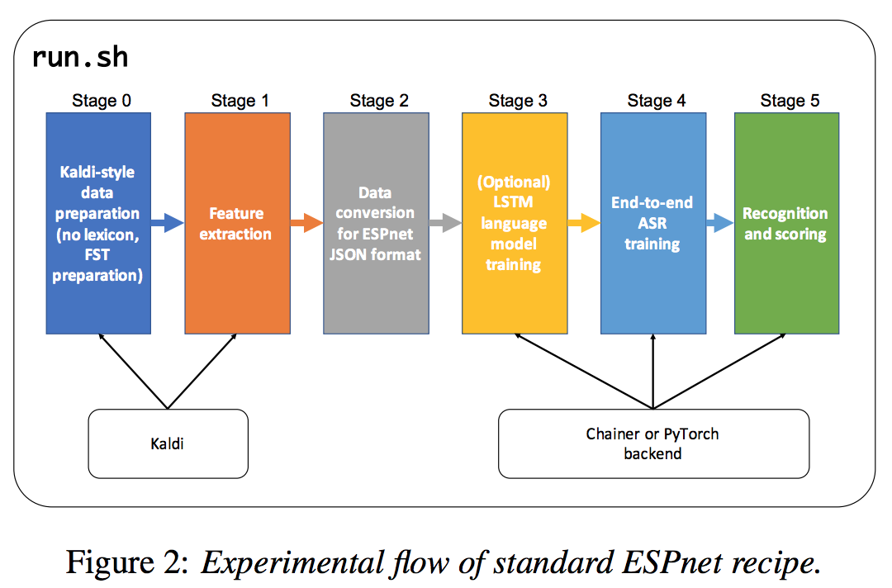

### Tabel

    - TTS model
    - Data structure
    - Project architecture
    - Training/Decoding/Synthesis flow

### TTS models in EPSnet
    - Tacotron
    - Taoctron2
    - Transformer
    - Fastspeech

## Main Function

### Data Preprocess

    - tts.decode()
data.json ->{make_batchset} List[List[Tuple[str, dict]]]...[0]
->{LoadInputsAndTargets(one_utt...)} (List[ndarray], List[ndarray], ...[1])
->{model.inference} outs, probs, att_wights  ...[2]

...[0]:
1st list: Batch List(Bath size equals gpu_numbers)
2nd list: Utterance List

...[1]:

...[2]:(in tts)
output is values of Middle Value, showed below:
Middle Value: OrderedDict([(x_name, List[ndarray]), (y_name, List[ndarray], (spembs_name, List[ndarray]), (spcs_name, List[ndarray]))])...
x_name: target1
y_name: input1
spcs_name: input2

    - tts.train()
data.json ->{make_batchset} List[List[Tuple[str, dict]]]
->{lambda} List[Tuple[str, dict]]
->{LoadInputsAndTargets} (List[ndarray], List[ndarray], ...)
->{CustomConverter} {"xs": List[tensor], "ilens":List[tensor],
                     "ys": List[tensor], "labels":, List[tensor],
                     "olens:": List[tensor]}...[1]
->{TransformDataset} dataset...
->{ChainerDataLoader} train_iter
->{CustomUpdater} updater
->{training.Trainer} trainer
->{trainer.extend(CustomEvaluater)}
->{trainer.extend(torch_snapshot())}
->{trainer.extend(snapshot_object(model, "model.loss.best"))}
->{trainer.extend(att_reporter)}
->{trainer.extend(extensions.PlotReport(plot_key))
->{trainer.extend(extensions.LogReport)
->{trainer.extend(extensions.PrintReport)
->{trainer.extend(extensions.ProgressBar())
->{trainer.extend(TensorboardLogger())
->{trainer.extend(ShufflingEnabler([train_iter]))
->{trainer.run()}
->{check_early_stop(trainer, args.epochs)}

...[1]
"labels" is for stop prediction
""
...[1]
CustomConverter and batchset are capsulized in ChainerDataLoader

### data.json structure

 - data_json
data_json = {
        "utt1": {
          "utt2spk": "Tom",
          "input": [
                          {
                              "feat": "/Users/rosen/speech_project/tts/espnet/egs/blizzard13/tts2_gst/dump/char_train_no_dev/feats.1.ark:29",
                              "name": "input1",
                              "shape": [
                                  968,
                                  80]
                          },
                          {
                              "feat": "/Users/rosen/speech_project/tts/espnet/egs/blizzard13/tts2_gst/dump/char_train_no_dev/feats.4.ark:29",
                              "name": "input2",
                              "shape": [
                                  968,
                                  513]
                          }
                      ],
          "output": [
                    {
                    "name": "target1",
                    "shape": [108,42],
                    "text": "JANE EYRE AN AUTOBIOGRAPHY BY CHARLOTTE BRONTE CHAPTER I THERE WAS NO POSSIBILITY OF TAKING A WALK THAT DAY.",
                    "token": "J A N E <space> E Y R E <space> A N <space> A U T O B I O G R A P H Y <space> B Y <space> C H A R L O T T E <space> B R O N T E <space> C H A P T E R <space> I <space> T H E R E <space> W A S <space> N O <space> P O S S I B I L I T Y <space> O F <space> T A K I N G <space> A <space> W A L K <space> T H A T <space> D A Y .",
                    "tokenid": "19 10 23 14 8 14 34 27 14 8 10 23 8 10 30 29 24 11 18 24 16 27 10 25 17 34 8 11 34 8 12 17 10 27 21 24 29 29 14 8 11 27 24 23 29 14 8 12 17 10 25 29 14 27 8 18 8 29 17 14 27 14 8 32 10 28 8 23 24 8 25 24 28 28 18 11 18 21 18 29 34 8 24 15 8 29 10 20 18 23 16 8 10 8 32 10 21 20 8 29 17 10 29 8 13 10 34 6"
                    }]
                  }
      },
      {
        "utt2": {
        ...
      },
        ...
      }
  - Make

### Project architecture
- espnet
  - tools
    - kaldi
  - espnet
    - bin
      - **tts_train.py** (Parameter settings)
      - lm_train.py
      - asr_train.py
    - tts
      - pytorch_backend
        - **tts.py**     (Train process)
    - nets (All dl model architecture)
      - pytorch_backend
        - tacotron2
          - cbhg.py
          - decoder.py
          - encoder.py
        - transformer
          - ...
        - **e2e_tts_tacotron2.py**
        - wavenet.py
    - transform(wav data transform)
        - spectrogram
  - egs (example by data)
    - ljspeech
      - tts1 (Algorithm different)
        - conf (Hyper-param file)
          - decode.yml
          - gpu.yml
          - ...
        - util
          -
        - local (5_step, )
          - data_download.sh
          - data_pre.sh
          -
        - run.sh (Hardware, Hyper-param, 5_Step(download, prepare, train, decode??, synthesis))
        - cmd.sh
        - path.sh
      - tts2
        - ?
    - blizzard
  - utils
    - dump.sh
    - convert_fbank.sh
  - tools(kaldi file)
    - reming

### Process flow

stage-1: Data Download

stage 0: Data preparation

    -
    local/data_prep.sh ${db_root}/LJSpeech-1.1 data/${trans_type}_train ${trans_type}
    utils/validate_data_dir.sh --no-feats data/${trans_type}_train

stage 1: Feature Generation

    - Generate the fbank features; by default 80-dimensional fbanks on each frame
    make_fbank.sh ...

    - make a dev set
    utils/subset_data_dir.sh --last data/${trans_type}_train 500 data/${trans_type}_deveval
    ..

    - compute statistics for global mean-variance normalization
    compute-cmvn-stats scp:data/${train_set}/feats.scp data/${train_set}/cmvn.ark
    ...

    - dump features for training
    dump.sh --cmd "$train_cmd" --nj ${nj} --do_delta false \
        data/${train_set}/feats.scp data/${train_set}/cmvn.ark exp/dump_feats/${trans_type}_train ${feat_tr_dir}
    ...

    - Task dependent. You have to check non-linguistic symbols used in the corpus.

stage 2: Dictionary and Json Data Preparation

    - make json labels

stage 3: Text-to-speech model training

    - setup feature and duration for fastspeech knowledge distillation training
    local/setup_knowledge_dist.sh ...

    - Training
    tts_train.py \
       --backend ${backend} \
       --ngpu ${ngpu} \
       --minibatches ${N} \
       --outdir ${expdir}/results \
       --tensorboard-dir tensorboard/${expname} \
       --verbose ${verbose} \
       --seed ${seed} \
       --resume ${resume} \
       --train-json ${tr_json} \
       --valid-json ${dt_json} \
       --config ${train_config}
    Example
       --backend pytorch --ngpu 1 --minibatches 0 --outdir ../../egs/blizzard13/tts2_gst/exp/results_test --tensorboard-dir ../../egs/blizzard13/tts2_gst/tensorboard_ --verbose 1 --seed 1 --train-json  /home/Data/program_data/espnet2/dump/char_train_no_dev/data.json --valid-json /home/Data/program_data/espnet2/dump/char_dev/data.json --config ../../egs/blizzard13/tts2_gst/conf/train_pytorch_tacotron2+cbhg+gst.yaml

    
stage 4: Decoding

    - Decoding text to log Mel/Linear spec, att_ws, and att_probs as well
        1. Select best model or average several checkpoint
            - average_checkpoints.py

        2. Got 3 result above
            - tts.decode()   [see Detailed]

stage 5: Synthesis

    - Synthesize Wav file from Mel/Linear
        1. apply-cmvn.sh
            - apply cepstral mean and (optionally) variance normalization ???

        2. convert_fbank.sh(convert_fbank_to_wav.py) convert logmel_spc to linearspc
            - if mel, then convert to Linear by SVD
            - if lin, convert to wav by grifflin

stage 6: Objective Evaluation

    - evaluate cer
    local/ob_eval/evaluate_cer.sh

## Experiment

1. train experiment
    - Real train
        exp/char_train_no_dev_pytorch_train_pytorch_tacotron2+cbhg+gst
    - Debug train
     

2. Decode/Synthesis experiment
    - real decode/synthesis
        model.loss.best_decode         # decode
        model.loss.best_decode_denorm  # synthesis

    - debug decode
        ...decode_ys_inference        # delete style branch
        ...decode_ys_inference_denorm # 
       
1. ck_style_concnt
       
   --backend pytorch --ngpu 1 --minibatches 0 --outdir ../../egs/blizzard13/tts2_gst/exp/blizzard2013_char_train_no_dev_pytorch_train_pytorch_tacotron2+cbhg+gst/results_ck_style_concnt --tensorboard-dir ../../egs/blizzard13/tts2_gst/tensorboard/blizzard2013_char_train_no_dev_pytorch_train_pytorch_tacotron2+cbhg+gst/ck_style_concnt --verbose 1 --seed 1 --train-json  /home/Data/program_data/espnet2/dump/char_train_no_dev/data.json --valid-json /home/Data/program_data/espnet2/dump/char_dev/data.json --config ../../egs/blizzard13/tts2_gst/conf/train_pytorch_tacotron2+cbhg+gst.yaml

2. 

## Install
- install system level package, cmake, sox, sndfile, ffmpeg, flac

- Install Kaldi and set soft link inside of espnet
    - ln -s ../../tts/espnet/tools/kaldi
- Install Espnet
    - Set cuda
        - ./setup_cuda_env.sh /usr/local/cuda
    - set Conda env
        - ./setup_anaconda.sh ./venv
        - install numpy, configargparse
    - Make
        - cd ../tools
        - make   # install python library
        - 
    